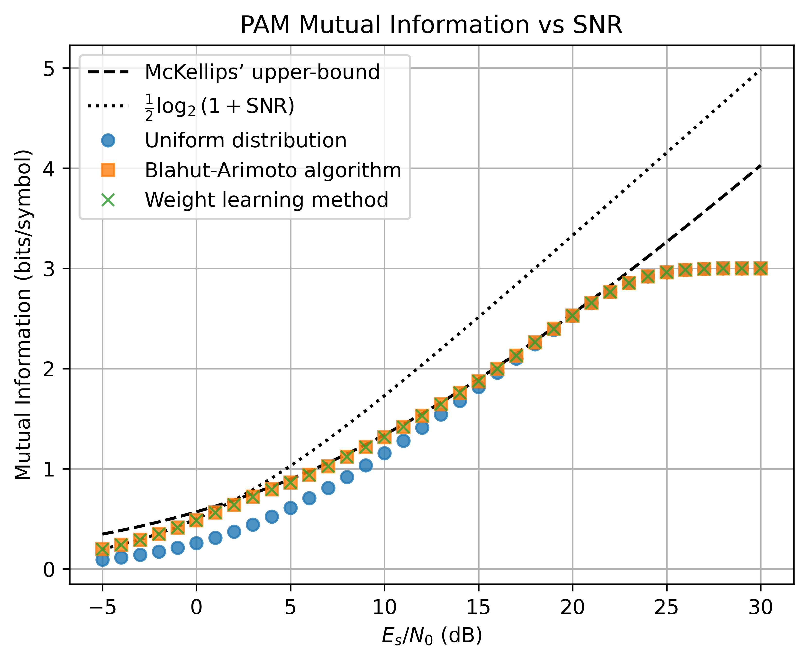
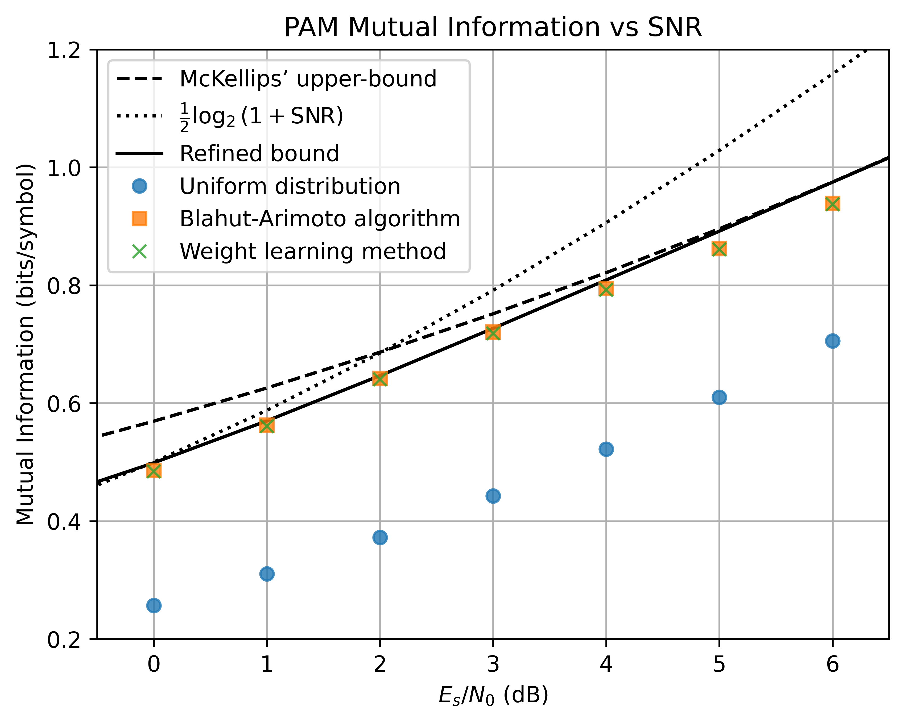
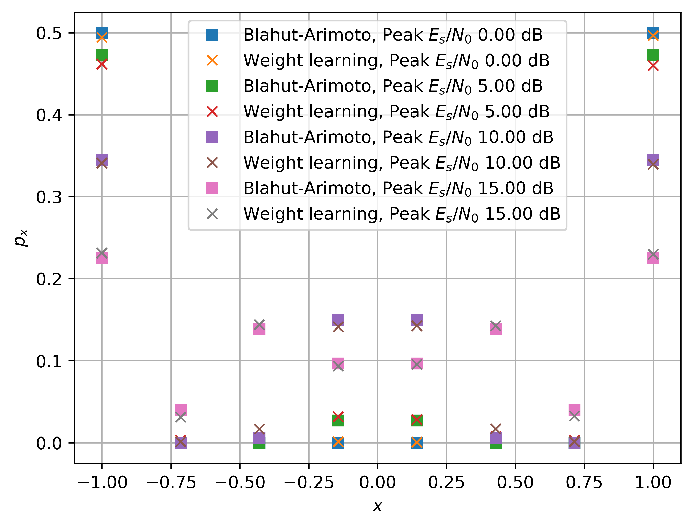
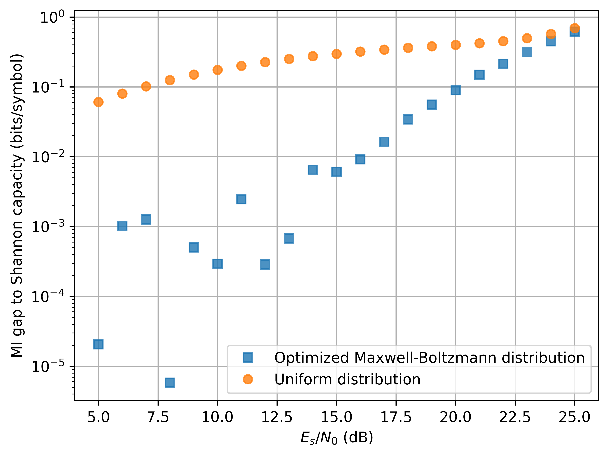

# End-to-End Learning of Probabilistic Constellation Shaping through Importance Sampling

Repository for the plots Shrinivas Chimmalgi, Laurent Schmalen, and Vahid Aref, ``End-to-End Learning of Probabilistic Constellation Shaping through Importance Sampling" including the data, scripts and plots.

The structure is as follows:\
|- AWGN_PPC_PAM_MI_opt.ipynb (Jupyter notebook for peak power constrained AWGN channel)\
|- AWGN_APC_MB_MI_opt.ipynb (Jupyter notebook for average power constrained AWGN channel)\
|- AWGN_PPC/ (directory containing the data for peak power constrained AWGN channel)\
|- AWGN_APC/ (directory containing the data for average power constrained AWGN channel)\
|- plots/ (directory containing all plots)\

<b>Mutual information (MI) for uniform and PCS 8-PAM. The symbol probabilities have been optimized to maximize MI for the AWGN channel under a peak power constraint. The Shannon capacity and McKellip’s upper bound are also shown. The symbol probabilities obtained through the weight learning method achieve very similar MI to that obtained through the Blahut-Arimoto algorithm.(./plots/AWGN_PPC_PAM8_MI.png)</b>

<b>Mutual information (MI) for uniform and PCS 8-PAM. The symbol probabilities have been optimized to maximize MI for the AWGN channel under a peak power constraint. In addition to the Shannon capacity and McKellip's upper bound, refined bound is also shown. The refined bound is known to be tight in the range of 0 dB - 6 dB.(./plots/AWGN_PPC_PAM8_MI_refined.png)</b>

<b>Mutual information optimized symbol probabilities of 8-PAM constellation for the AWGN channel under a peak power constraint. The probabilities are shown for two peak SNR values where the optimal distribution does not have a Gaussian Bell shape. The symbol probabilities obtained through the weight learning method match well with those obtained using the Blahut-Arimoto algorithm.(./plots/AWGN_PPC_PAM8_px.png)</b>

<b>Gap of MI to Shannon capacity for uniform and PCS 256-QAM. The symbol probabilities have been optimized to maximize BMI for the AWGN channel under the average power constraint.(./plots/AWGN_APC_256QAM_MI.png)</b>